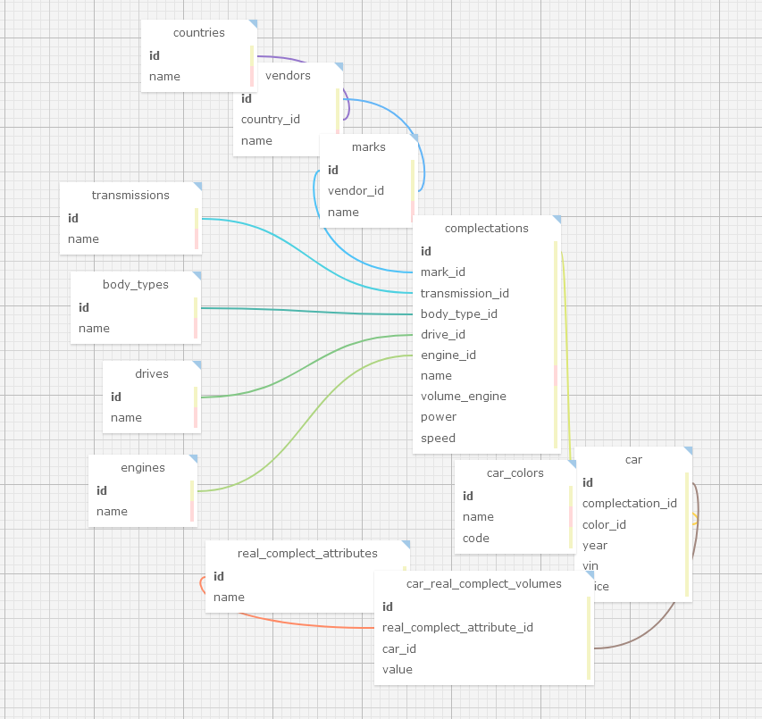

# Description

## settings
```shell
cp .env.example .env
```
```dotenv
DB_CONNECTION=mysql
DB_HOST=mysql
DB_PORT=3306
DB_DATABASE=<dbname>
DB_USERNAME=<dbname>
DB_PASSWORD=<dbname>

CACHE_DRIVER=redis
```
```shell
docker compose build
docker compose up -d
docker compose exec app php artisan key:generate
docker compose exec app php artisan migrate:fresh --seed
```

## DB Scheme

The database schema can be viewed on the website https://sql.toad.cz/ by copying the contents of the xml file db_scheme.xml



**Information about a car:**

- **VIN** - main characteristic of the car. Different wines, different cars. The car has a *non-changeable* configuration. By configuration you can find out the model and manufacturer. country, transmission, body type, engine type, drive type.
- A car has individual attributes, the value of which for each car may differ in quantitative terms.
## Консольная команда

```shell
docker compose exec app php artisan catalog:add-or-update-car-command "{\"country\":\"Россия\",\"vendor\":\"Авто ТАЗ\",\"mark\":\"Веста\",\"complectation\":\"Супер +\",\"color\":\"Баклажан\",\"vin\":\"565497H3\",\"price\":\"100500\",\"year\":\"2024\",\"body_type\":\"Седан\",\"engine\":\"Бензин\",\"drive\":\"Передний\",\"transmission\":\"Механика\",\"volume_engine\":\"1500\",\"power\":\"3500\",\"speed\":\"210\",\"real_attributes\":[{\"name\":\"Противоугонная система\",\"values\":[\"А\",\"Б\",\"В\",\"Г\"]},{\"name\":\"Комфорт\",\"values\":[\"А\",\"Б\",\"В\",\"Г\"]},{\"name\":\"Салон и интерьер\",\"values\":[\"А\",\"Б\",\"В\",\"Г\"]}]}"
```
Декодированная строка:
```php
[
            'country' => 'Россия',          // Страна производителя
            'vendor' => 'Авто ТАЗ',         // Производитель авто
            'mark' => 'Веста',              // Марка авто
            'complectation' => 'Супер +',   // Комплектация авто
            'color' => 'Баклажан',          // Цвет
            'vin' => '565497H3',            // ВИН
            'price' => '100500',            // Цена
            'year' => '2024',               // Год выпуска
            'body_type' => 'Седан',         // Тип кузова
            'engine' => 'Бензин',           // Тип двигателя
            'drive' => 'Передний',          // Тип привода
            'transmission' => 'Механика',   // Коробка передач
            'volume_engine' => '1500',      // Объем двигателя
            'power' => '3500',              // Мощность авто
            'speed' => '210',               // Заявленная скорость
            'real_attributes' => [          // Аттрибуты, принадлежащие конкретному авто
                [
                    'name' => 'Противоугонная система', // Тип аттрибута
                    'values' => ['А','Б','В','Г']       // Значения аттрибута
                ],
                [
                    'name' => 'Комфорт',
                    'values' => ['А','Б','В','Г']
                ],
                [
                    'name' => 'Салон и интерьер',
                    'values' => ['А','Б','В','Г']
                ]
            ]
```
### Validation and create or update 

- **Complectation**
- - check for exist; if it exists, then for membership in the mark
- - if it does not exist, then create a new configuration
- **Mark**
- - check for exist; if it exists, then for membership in the vendor
- - if it does not exist, then create a new mark
- **Vendor**
- - check for exist; if it exists, then for membership in the country
- - if it does not exist, then create a new vendor
- **Transmission, body type, engine, drive**
- - check for exist 
- **Реальные аттрибуты**
- - check for exist. Let's assume that there are many of them, but they are created using separate methods..

After validating all input data, we create a model if the vin is not found or update the model if such a vin exists in the database.
## Cache
The creation or updating of the cache is monitored by the car model observer. The model with all loaded relationships is cached for display on the product card page.

Caching in redis by key: Model name: why we cache: model id

## GET method
```http request
http://127.0.0.1:8089/api/auto/:auto
```
